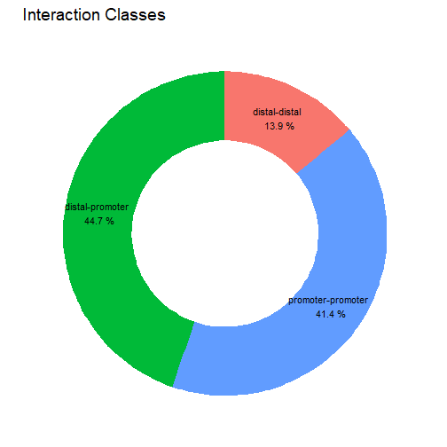
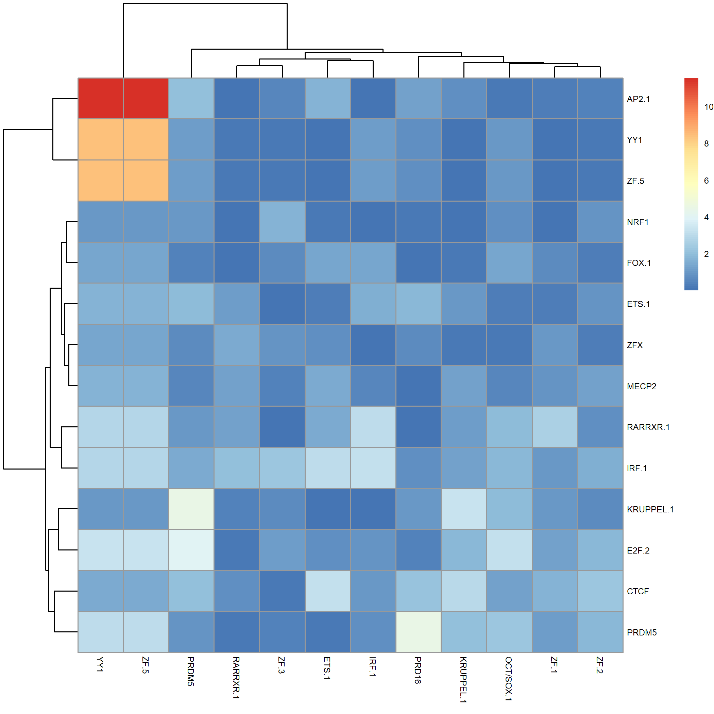
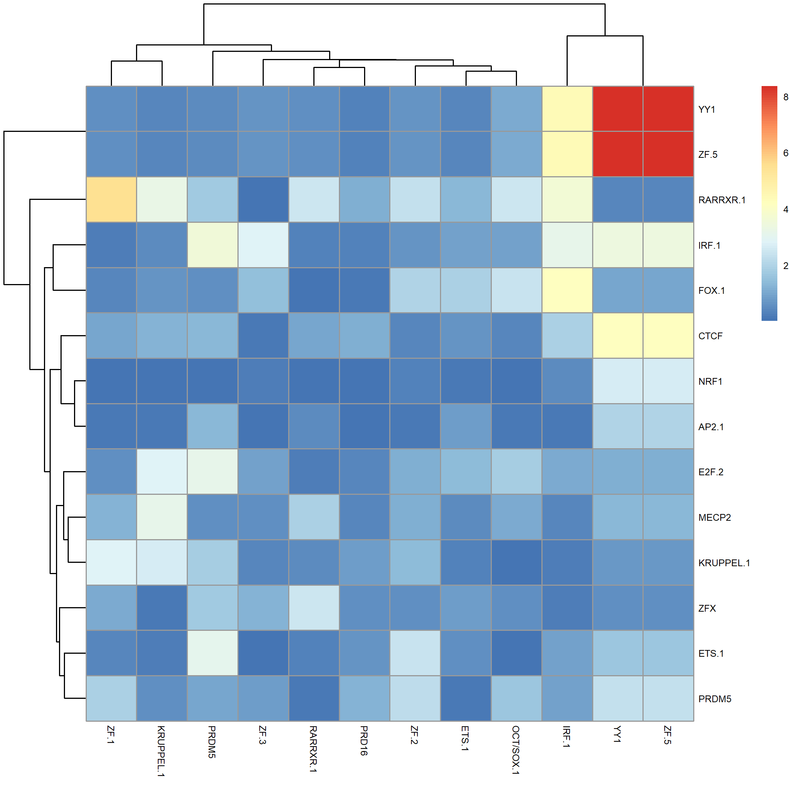

```r
set.seed(17)
library(spatzie)
```

# Genome assembly specific configuration


```r
genome_id <- "BSgenome.Mmusculus.UCSC.mm9"
if (!(genome_id %in% rownames(utils::installed.packages()))) {
  BiocManager::install(genome_id, update = FALSE, ask = FALSE)
}
genome <- BSgenome::getBSgenome(genome_id)


txdb_id <- "TxDb.Mmusculus.UCSC.mm9.knownGene"
if (!(txdb_id %in% rownames(utils::installed.packages()))) {
  BiocManager::install(txdb_id, update = FALSE, ask = FALSE)
}
txdb <- TxDb.Mmusculus.UCSC.mm9.knownGene::TxDb.Mmusculus.UCSC.mm9.knownGene

ensembl_data_set <- "mmusculus_gene_ensembl"
gene_symbol <- "mgi_symbol"
```

# Load data


```r
yy1_interactions_file <- system.file("extdata/yy1_interactions.bedpe.gz",
                                     package = "spatzie")
yy1_interactions <- GenomicInteractions::makeGenomicInteractionsFromFile(
  yy1_interactions_file,
  type = "bedpe",
  experiment_name = "yy1",
  description = "mESC yy1 chr1")
length(yy1_interactions)
```

```
## [1] 40000
```

# Load mouse promoter information


```r
promoter_ranges <- GenomicFeatures::promoters(txdb,
                                              upstream = 2500,
                                              downstream = 2500,
                                              columns = c("tx_name", "gene_id"))
# trims out-of-bound ranges located on non-circular sequences
promoter_ranges <- GenomicRanges::trim(promoter_ranges)
# remove duplicate promoters from transcript isoforms
promoter_ranges <- BiocGenerics::unique(promoter_ranges)

promoters_df <- as.data.frame(promoter_ranges)
promoters_df$gene_id <- as.character(promoters_df$gene_id)

ensembl <- biomaRt::useMart("ensembl", dataset = ensembl_data_set)

id_df <- biomaRt::getBM(attributes = c("entrezgene_id", gene_symbol),
                        filters = "entrezgene_id",
                        values = unique(promoters_df$gene_id),
                        mart = ensembl)

names(promoter_ranges) <- id_df[match(promoters_df$gene_id,
                                      id_df$entrezgene_id), gene_symbol]
missing_idx <- is.na(names(promoter_ranges)) | names(promoter_ranges) == ""
names(promoter_ranges)[missing_idx] <- promoters_df$tx_name[missing_idx]
```

# Annotate interactions with promoters


```r
annotation_features <- list(promoter = promoter_ranges)
GenomicInteractions::annotateInteractions(yy1_interactions, annotation_features)
GenomicInteractions::plotInteractionAnnotations(yy1_interactions)
```



# Limit and sort interactions to enhancer:promoter


```r
distal_promoter_idx <- GenomicInteractions::isInteractionType(
  yy1_interactions, "distal", "promoter")
yy1_pd <- yy1_interactions[distal_promoter_idx]
anchor1 <- GenomicInteractions::anchorOne(yy1_pd)
anchor2 <- GenomicInteractions::anchorTwo(yy1_pd)

promoter_left <- S4Vectors::elementMetadata(anchor1)[, "node.class"] == "promoter"
promoter_right <- S4Vectors::elementMetadata(anchor2)[, "node.class"] == "promoter"
promoter_ranges <- c(anchor1[promoter_left],
                     anchor2[promoter_right])
enhancer_ranges <- c(anchor2[promoter_left],
                     anchor1[promoter_right])
yy1_pd <- GenomicInteractions::GenomicInteractions(promoter_ranges,
                                                   enhancer_ranges)
```

# Scan motifs


```r
motifs_file <- system.file("extdata/motifs_subset.txt.gz",
                           package = "spatzie")
motifs <- TFBSTools::readJASPARMatrix(motifs_file, matrixClass = "PFM")
yy1_pd_interaction <- scan_motifs(yy1_pd, motifs, genome)
yy1_pd_interaction <- filter_motifs(yy1_pd_interaction, 0.4)
```

# Compute motif co-significance

## Correlation between motif counts


```r
yy1_pd_count_corr <- anchor_pair_enrich(yy1_pd_interaction,
                                        method = "count")
pheatmap::pheatmap(-log2(yy1_pd_count_corr$pair_motif_enrich), fontsize = 6)
```



## Correlation between max motif scores


```r
yy1_pd_score_corr <- anchor_pair_enrich(yy1_pd_interaction,
                                        method = "score")
pheatmap::pheatmap(-log2(yy1_pd_score_corr$pair_motif_enrich), fontsize = 6)
```


