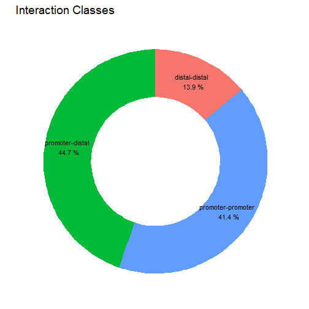
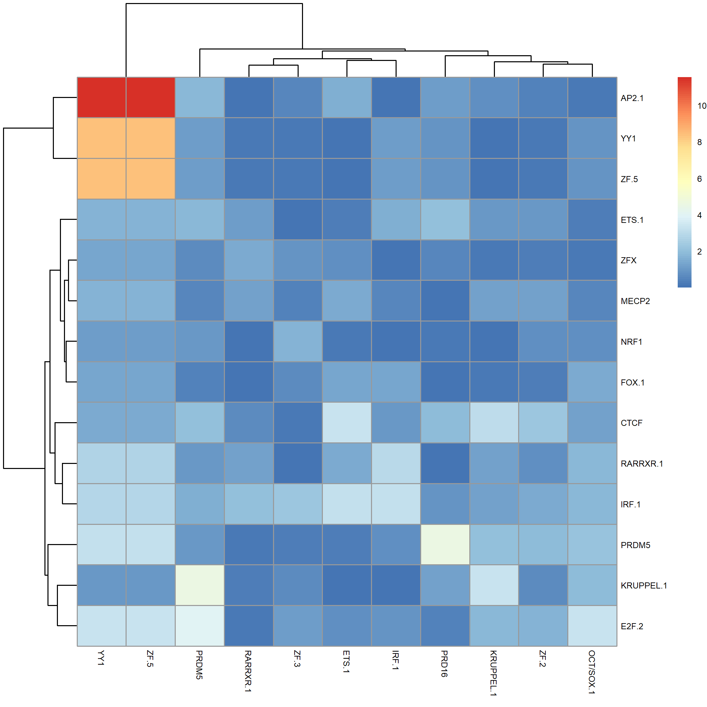

```r
set.seed(17)
library(spatzie)
```
This vignette describes how to use spatzie to identify pairs of transcription factors whose sequence motifs (that describe their binding sites) are co-enriched in enhancers and promoters that interact with each other. ChIA-PET, HiChIP or HiC are molecular biology assays commonly used to investigate long-range genomic interactions and the data they generate, once properly processed (BEDPE format), serves as input to spatzie co-enrichment analyses.


# Load data

Here we use interactions data in BEDPE format based on a ChIA-PET assay. *Interactions data* in BEDPE format is a tab-separated file, where each line describes one interaction between two *anchors*, i.e., two regions of the genome that are potentially far away from each other.

`yy1_interactions_file` is a toy BEDPE example data from a ChIA-PET experiment in murine embryonic stem cells, targeting the transcription factor YY1.

`motifs_file` is a toy motif database. The HOCOMOCO motif database is commonly used, but any motif file compatible with `TFBSTools::readJASPARMatrix()` can be used.


```r
yy1_interactions_file <- system.file("extdata/yy1_interactions.bedpe.gz",
                                     package = "spatzie")
int_data_df <- read.table(gzfile(yy1_interactions_file), header = TRUE,
                          sep = "\t")

motifs_file <- system.file("extdata/motifs_subset.txt.gz",
                           package = "spatzie")
```

# Run spatzie enhancer-promoter motif co-enrichment analysis

`spatzie::find_ep_coenrichment()` identifies co-enriched pairs of motifs in enhancer-promoter interactions by first annotating interaction anchors in `int_data_df` and discarding interactions that are not between promoters and enhancers. Second, anchor regions are scanned for motif hits using `spatzie::scan_motifs()`. Third, motifs present in less than a certain fraction of interactions are discarded (`spatzie::filter_motifs()`). And fourth, `spatzie::anchor_pair_enrich()` identifies co-enriched motif pairs, i.e., motif A is consistently present in promoters that interact with enhancers containing motif B.


```r
res <- spatzie::find_ep_coenrichment(int_data_df, motifs_file,
                                     motifs_file_matrix_format = "pfm",
                                     genome_id = "mm9",
                                     cooccurrence_method = "count")
```

For more information, please see the help page (`?spatzie::find_ep_coenrichment`) and the spatzie paper (`citation("spatzie")`).

# Results

## Interaction type pie chart

The plot shows the types of interactions before filtering.


```r
plot(res$annotation_pie_chart)
```



## Motif co-enrichment matrix

The heatmap shows co-enrichment for all motif pairs.


```r
pheatmap::pheatmap(-log2(res$motif_cooccurrence$pair_motif_enrich),
                   fontsize = 6)
```



# Session info


```r
sessionInfo()
```

```
## R version 4.0.5 (2021-03-31)
## Platform: x86_64-w64-mingw32/x64 (64-bit)
## Running under: Windows 10 x64 (build 19042)
## 
## Matrix products: default
## 
## locale:
## [1] LC_COLLATE=English_United States.1252  LC_CTYPE=English_United States.1252    LC_MONETARY=English_United States.1252
## [4] LC_NUMERIC=C                           LC_TIME=English_United States.1252    
## 
## attached base packages:
## [1] stats4    parallel  stats     graphics  grDevices utils     datasets  methods   base     
## 
## other attached packages:
##  [1] BSgenome.Mmusculus.UCSC.mm9_1.4.0 BSgenome_1.58.0                   rtracklayer_1.50.0                Biostrings_2.58.0                
##  [5] XVector_0.30.0                    GenomicRanges_1.42.0              GenomeInfoDb_1.26.7               IRanges_2.24.1                   
##  [9] S4Vectors_0.28.1                  BiocGenerics_0.36.1               spatzie_0.99.5                    usethis_2.0.1                    
## 
## loaded via a namespace (and not attached):
##   [1] backports_1.2.1                         Hmisc_4.5-0                             BiocFileCache_1.14.0                   
##   [4] plyr_1.8.6                              igraph_1.2.6                            lazyeval_0.2.2                         
##   [7] splines_4.0.5                           BiocParallel_1.24.1                     ggplot2_3.3.3                          
##  [10] TFBSTools_1.28.0                        digest_0.6.27                           ensembldb_2.14.1                       
##  [13] htmltools_0.5.1.1                       GO.db_3.12.1                            fansi_0.4.2                            
##  [16] magrittr_2.0.1                          checkmate_2.0.0                         memoise_2.0.0                          
##  [19] cluster_2.1.1                           InteractionSet_1.18.1                   readr_1.4.0                            
##  [22] annotate_1.68.0                         matrixStats_0.58.0                      R.utils_2.10.1                         
##  [25] askpass_1.1                             prettyunits_1.1.1                       jpeg_0.1-8.1                           
##  [28] colorspace_2.0-0                        blob_1.2.1                              rappdirs_0.3.3                         
##  [31] xfun_0.22                               dplyr_1.0.5                             crayon_1.4.1                           
##  [34] RCurl_1.98-1.3                          TFMPvalue_0.0.8                         survival_3.2-10                        
##  [37] VariantAnnotation_1.36.0                glue_1.4.2                              gtable_0.3.0                           
##  [40] zlibbioc_1.36.0                         DelayedArray_0.16.3                     scales_1.1.1                           
##  [43] pheatmap_1.0.12                         DBI_1.1.1                               TxDb.Mmusculus.UCSC.mm9.knownGene_3.2.2
##  [46] Rcpp_1.0.6                              xtable_1.8-4                            progress_1.2.2                         
##  [49] htmlTable_2.2.1                         foreign_0.8-81                          bit_4.0.4                              
##  [52] Formula_1.2-4                           htmlwidgets_1.5.3                       httr_1.4.2                             
##  [55] RColorBrewer_1.1-2                      ellipsis_0.3.2                          pkgconfig_2.0.3                        
##  [58] XML_3.99-0.6                            R.methodsS3_1.8.1                       farver_2.1.0                           
##  [61] Gviz_1.34.1                             nnet_7.3-15                             dbplyr_2.1.1                           
##  [64] utf8_1.2.1                              tidyselect_1.1.1                        labeling_0.4.2                         
##  [67] rlang_0.4.10                            reshape2_1.4.4                          AnnotationDbi_1.52.0                   
##  [70] munsell_0.5.0                           tools_4.0.5                             cachem_1.0.4                           
##  [73] DirichletMultinomial_1.32.0             generics_0.1.0                          RSQLite_2.2.7                          
##  [76] evaluate_0.14                           stringr_1.4.0                           fastmap_1.1.0                          
##  [79] yaml_2.2.1                              knitr_1.33                              bit64_4.0.5                            
##  [82] fs_1.5.0                                caTools_1.18.2                          purrr_0.3.4                            
##  [85] KEGGREST_1.30.1                         AnnotationFilter_1.14.0                 R.oo_1.24.0                            
##  [88] poweRlaw_0.70.6                         pracma_2.3.3                            xml2_1.3.2                             
##  [91] biomaRt_2.46.3                          compiler_4.0.5                          rstudioapi_0.13                        
##  [94] curl_4.3.1                              png_0.1-7                               tibble_3.1.1                           
##  [97] stringi_1.5.3                           highr_0.9                               GenomicFeatures_1.42.3                 
## [100] lattice_0.20-41                         ProtGenerics_1.22.0                     CNEr_1.26.0                            
## [103] Matrix_1.3-2                            vctrs_0.3.8                             pillar_1.6.1                           
## [106] GenomicInteractions_1.24.0              lifecycle_1.0.0                         data.table_1.14.0                      
## [109] bitops_1.0-7                            R6_2.5.0                                latticeExtra_0.6-29                    
## [112] gridExtra_2.3                           dichromat_2.0-0                         gtools_3.8.2                           
## [115] assertthat_0.2.1                        seqLogo_1.56.0                          SummarizedExperiment_1.20.0            
## [118] openssl_1.4.4                           GenomicAlignments_1.26.0                Rsamtools_2.6.0                        
## [121] GenomeInfoDbData_1.2.4                  hms_1.1.0                               motifmatchr_1.12.0                     
## [124] grid_4.0.5                              rpart_4.1-15                            rmarkdown_2.8                          
## [127] MatrixGenerics_1.2.1                    biovizBase_1.38.0                       Biobase_2.50.0                         
## [130] base64enc_0.1-3
```
